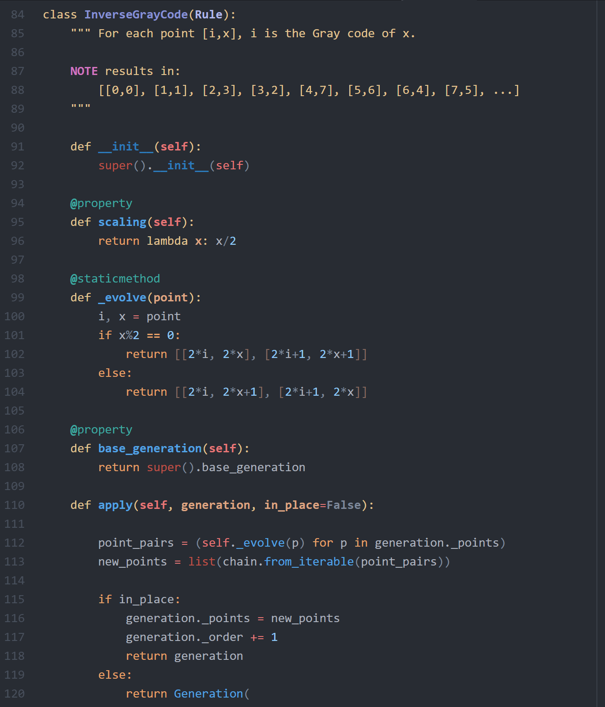

# Brunel syntax theme for Atom

Brunel is a dark theme for Python. It uses MagicPython classes (not the default language-python ones; you will need to install the MagicPython grammar to get the most out of this theme).

The colour scheme is loosely based on One Dark and derivative themes (e.g. *dark snek*), and has been modified to exploit the full extent of MagicPython highlighting without sacrificing visual simplicity.

This theme is suitable for all levels of Python developer, offering great readability as well as subtle fine detail differentiation when you need it (e.g. in nested structures, string formatting, regular expressions).

Brunel is the author's preferred MagicPython theme.
